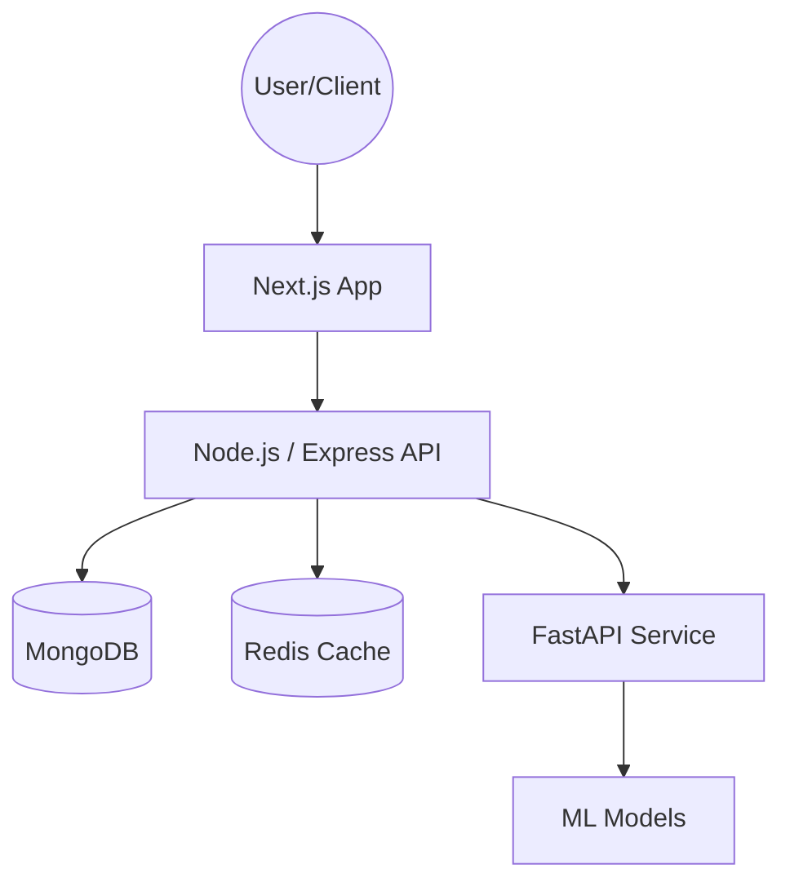

# AEROSTEP AI: System Architecture

This document outlines the high-level architecture and technical stack of the AEROSTEP AI platform.

## 🏗️ Overview

AEROSTEP AI is a multi-tier eCommerce platform that leverages artificial intelligence to provide personalized footwear experiences.

## 💻 Tech Stack

### Frontend
- **Framework**: Next.js 15+ (App Router)
- **Styling**: Tailwind CSS v4
- **3D Engine**: Three.js / React Three Fiber
- **State Management**: React Context / Hooks

### Backend
- **Framework**: Node.js / Express
- **Language**: TypeScript
- **Database**: MongoDB (Mongoose)
- **Payment**: Stripe API

### AI Service
- **Framework**: FastAPI (Python)
- **Inference**: Scikit-learn / Custom Algorithms
- **Refactoring**: Modular API structure with Pydantic settings

## 📂 Project Structure

- `/frontend`: Modern React application with 3D product visualization.
- `/backend`: Scalable API managing users, products, and orders.
- `/ai-service`: Lightweight Python service for specialized ML tasks.
- `/docs`: Technical documentation and architecture guides.
- `/assets`: Centralized repository for 3D models and high-res media.
